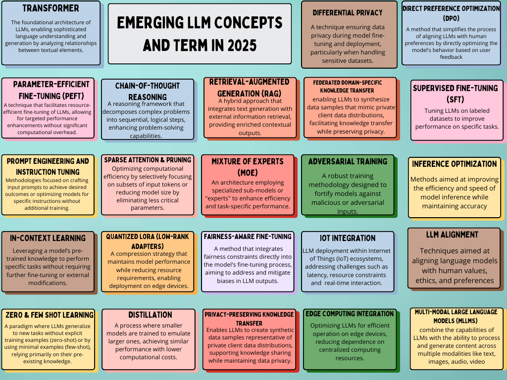

# 🚀 Emerging LLM Concepts and Terms in 2025 - Cheatsheet 🚀

A comprehensive cheatsheet designed to guide AI enthusiasts, developers and researchers through the latest trends and techniques shaping the world of Large Language Models (LLMs). This resource simplifies complex ideas and makes emerging LLM concepts accessible to everyone. Whether you're exploring foundational techniques or advanced applications, this cheatsheet provides a clear overview of what matters most in 2025.

## What You'll Find Inside:
This cheatsheet covers a wide array of **key terms and methodologies** that are gaining attention in the field of LLM development. Each concept is carefully explained to give you a solid foundation in LLMs.

### 1. **Transformers**  
   - **Description**: At the heart of modern NLP, Transformers have revolutionized how models learn from sequential data. Learn how this architecture has impacted the entire landscape of AI, driving advancements in natural language understanding and generation.
   - **Applications**: Widely used in models like GPT, BERT and T5.

### 2. **Retrieval-Augmented Generation (RAG)**  
   - **Description**: A combination of retrieval techniques with generative models. This approach enhances model performance by incorporating external knowledge from large datasets, resulting in more accurate and contextually aware outputs.
   - **Applications**: Used in chatbots, document summarization and fact-checking systems.

### 3. **Distillation**  
   - **Description**: A method for compressing large models into smaller, more efficient ones while retaining the accuracy. Distillation allows models to run faster and consume less memory without sacrificing performance.
   - **Applications**: Ideal for deploying models on edge devices or in resource-constrained environments.

### 4. **Mixture of Experts (MOE)**  
   - **Description**: An innovative technique where multiple sub-models (experts) collaborate to improve model efficiency. This method enhances scalability and performance while optimizing resource use.
   - **Applications**: Used in recommendation systems, multi-task learning and complex decision-making models.

### 5. **Zero & Few-Shot Learning**  
   - **Description**: Techniques that enable models to perform tasks with minimal or no labeled data. These approaches rely on pre-trained knowledge, significantly improving the speed and flexibility of AI applications.
   - **Applications**: Key in domains where labeled data is scarce, like healthcare, legal services and new product development.

### 6. **Chain-of-Thought Reasoning**  
   - **Description**: A logical approach that helps models reason step-by-step to reach a solution. By breaking down problems, models gain clarity in their decision-making processes, improving accuracy in complex queries.
   - **Applications**: Useful in tasks like mathematical problem-solving, QA systems and scientific reasoning.

### 7. **Prompt Engineering & Instruction Tuning**  
   - **Description**: A skill that involves crafting effective prompts to guide models toward specific outputs. Instruction tuning improves the model's ability to follow complex and nuanced commands.
   - **Applications**: Essential in building highly customized AI applications, such as assistants, chatbots and content generators.

### 8. **Sparse Attention & Pruning**  
   - **Description**: Techniques that reduce computational cost by limiting the attention span of models. Sparsely connected attention mechanisms enable faster processing while maintaining high model performance.
   - **Applications**: Useful in reducing the memory footprint of large models, making them more efficient for deployment in edge devices and real-time applications.

### 9. **Parameter-Efficient Fine-Tuning (PEFT)**  
   - **Description**: A fine-tuning approach that focuses on updating only a small set of parameters in a pre-trained model, drastically reducing training time and computational demands.
   - **Applications**: Common in transfer learning, where models are adapted to specific tasks without needing to start training from scratch.

### 10. **Quantized LoRA (Low-Rank Adapters)**  
   - **Description**: A technique for compressing models by using low-rank approximations. Quantized LoRA helps in reducing model size while retaining performance, making it ideal for large-scale deployment.
   - **Applications**: Widely applied in mobile and edge AI where memory and computation are limited.

### 11. **Differential Privacy**  
   - **Description**: A privacy-preserving method that ensures minimal information leakage during model training. It enables the development of AI systems that respect user privacy while still delivering robust performance.
   - **Applications**: Important in sectors like finance, healthcare and government, where sensitive data must be protected.

### 12. **Fairness-Aware Fine-Tuning**  
   - **Description**: Techniques designed to mitigate bias in AI models during fine-tuning. Fairness-aware approaches aim to reduce harmful disparities in model outputs.
   - **Applications**: Essential in social AI applications like hiring systems, financial services and predictive policing tools.

### 13. **Privacy-Preserving Knowledge Transfer**  
   - **Description**: Methods that allow knowledge to be transferred between models without exposing sensitive data. These techniques ensure safe collaboration across models without breaching data privacy.
   - **Applications**: Relevant in industries like healthcare, where sharing insights without disclosing patient information is crucial.

### 14. **IoT Integration**  
   - **Description**: LLMs are being used in IoT systems to analyze data collected from sensors and devices, enabling intelligent decision-making and automation.
   - **Applications**: Essential in smart homes, industrial automation and connected health devices.

### 15. **Edge Computing Integration**  
   - **Description**: LLMs are being deployed at the edge to process data locally, reducing latency and improving real-time decision-making in applications like autonomous vehicles and industrial IoT.
   - **Applications**: Key in applications requiring low-latency and high-efficiency processing at the device level.

### 16. **Multi-Modal LLMs (MLLMs)**  
   - **Description**: These models process multiple types of data—text, images, audio—simultaneously. MLLMs are designed to understand and generate information from different data modalities.
   - **Applications**: Used in applications like content creation, multimedia search and AI-driven content understanding.

### 17. **LLM Alignment**  
   - **Description**: A process of aligning LLMs to human values, ensuring that their outputs are ethical, responsible and aligned with societal expectations.
   - **Applications**: Important in applications like AI assistants, chatbots and any system that interacts with users and makes decisions.

### 18. **Inference Optimization**  
   - **Description**: Techniques to optimize how LLMs perform inference, making predictions faster and more efficient while reducing computational resources.
   - **Applications**: Critical in real-time applications, such as automated trading systems, recommendation engines and customer service bots.

### 19. **Direct Preference Optimization (DPO)**  
   - **Description**: A fine-tuning technique that directly optimizes model predictions based on user preferences and feedback, leading to better outcomes in personalized AI applications.
   - **Applications**: Used in recommendation systems, personalized search engines and user-centric AI applications.

---

## Why This Cheatsheet is Important:
In 2025, LLMs are advancing rapidly, bringing new techniques that are shaping the AI landscape. This cheatsheet serves as a friendly guide to understanding these key concepts. By simplifying complex terms into clear explanations, it helps both beginners and experienced practitioners stay informed and up-to-date.

## How to Use This Cheatsheet:
- **Quick Reference**: Use this cheatsheet to quickly look up essential LLM terms and techniques.
- **Learning Tool**: For understanding foundational concepts or refreshing knowledge in the LLM space.

---

### Contribution:
Contributions are highly welcomed! Feel free to suggest additional terms, improve explanations, or enhance the content.  
To contribute:
1. Fork the repository.
2. Create a new branch.
3. Make your changes and commit them.
4. Push your changes and submit a pull request.

---

### License:
This cheatsheet is shared under the [MIT License](LICENSE).

---

### Connect with Us:
- **GitHub**: https://github.com/Abonia1
- **LinkedIn**: https://www.linkedin.com/in/aboniasojasingarayar
- **Youtube**: https://www.youtube.com/channel/UCGphGM_oeR4r9dqVs71Jc5w

